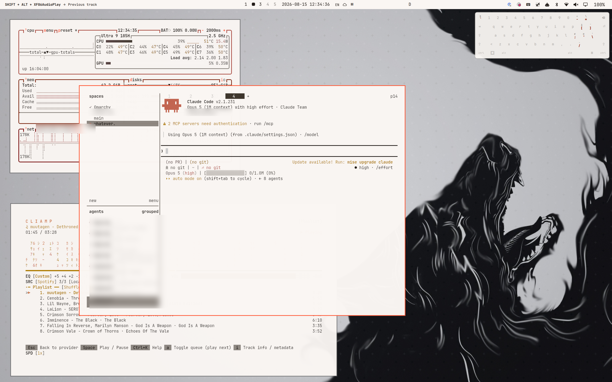

# ulf — a monochrome orange Omarchy theme

Two paired [Omarchy](https://omarchy.org) themes drawn from the
[omarchyplugins.com](https://omarchyplugins.com) palette: near-black surfaces,
sharp corners, and a single orange accent `#ff5a36`.

Every chromatic slot lives in OKLCH hue **22–108**. There is no blue, no green
and no magenta — only the warm band. Named ANSI slots are kept because they are
positional, not descriptive: apps ask for "colour 4" and only need it to be
reliably distinguishable, so `blue` and `cyan` become the low-chroma ash tier.

| | dark | light |
|---|---|---|
| background | `#0d0b09` | `#faf6f3` |
| foreground | `#d7d3d0` | `#221c18` |
| accent | `#ff5a36` | `#ff5a36` |
| red | `#dc4506` | `#720000` |
| green | `#d57059` | `#7e2913` |
| yellow | `#ffb000` | `#8b6000` |
| blue | `#7d7969` | `#3c342b` |
| magenta | `#f06400` | `#ad4e44` |
| cyan | `#b7a993` | `#564241` |

## ulf


## ulf-light



## Install

The repo root **is** the dark theme, so Omarchy installs it directly:

```bash
omarchy theme install git@github.com:<you>/omarchy-ulf-theme.git
```

The light variant lives in `light/` and is installed by copying it in:

```bash
cp -r ~/.config/omarchy/themes/ulf/light ~/.config/omarchy/themes/ulf-light
omarchy theme set ulf-light
```

### The appearance hook (recommended)

`omarchy theme set` does not touch GTK or gsettings, so switching between the
two variants would leave the desktop signalling the wrong mode. Install the
hook and light/dark follows the active theme:

```bash
omarchy hook install theme-set hooks/theme-set.d/gtk-appearance
```

Four places have to agree, and fixing one does not fix the others:

| signal | read by |
|---|---|
| `gsettings color-scheme` | libadwaita, some GTK4 |
| `gsettings gtk-theme` | GTK3 |
| `gtk-{3,4}.0/gtk.css` | every GTK app — **overrides the two above** |
| `gtk-application-prefer-dark-theme` | Chromium's system-theme path only |

Each theme ships its own `gtk.css`; the hook swaps it on every theme change. A
stale one left over from another theme is exactly what makes apps render light
under a dark theme.

## How the palette was derived

In a monochrome palette hue carries no information, so lightness and chroma
have to do all the separating — which makes slot placement a constraint problem
rather than something to pick by eye. `tools/palette-search.py` (and
`palette-search-light.py`) run a randomised search plus hill-climbing that
maximises the worst of **all 91 non-twin pairs**, scored in OKLab under normal,
protanopic and deuteranopic vision, subject to:

- bright twins need a lightness step ≥ 0.06
- base ANSI slots must clear WCAG AA against the background
- `green` is pinned to hue 26–52 so it sits beside the accent
- the *measured* hue is checked, not the requested one — above L≈0.86 sRGB
  cannot hold a low-hue orange and clips toward peach, drifting the hue up

Worst pair: **0.0526** dark, **0.0423** light. The light variant scores lower
because AA on a near-white ground caps every slot below L≈0.55, compressing the
palette into rust and terracotta.

**Do not hand-edit a colour.** Change the constraints and re-run the search,
then regenerate.

## Regenerating

The themes are rendered by [Aether](https://github.com/omacom-io/aether) from
`source-colors.toml`, which it must fetch over http:

```bash
cd <dir containing source-colors.toml> && python3 -m http.server 8731 &
aether --handle-url 'aether://apply?colors=http://127.0.0.1:8731/source-colors.toml&as_omarchy_theme=ulf&silent=true'
tools/regenerate-patch.sh
```

Aether owns every rendered file it writes, so `tools/regenerate-patch.sh`
replays the hand corrections afterwards — chiefly forcing the window border,
hyprlock ring, mako border and icon theme back to the orange accent. Aether
derives its own secondary accents and picks **ANSI blue** for borders, which in
this palette is a near-neutral, so without the patch the orange border comes out
grey.

Two Aether traps worth knowing:

1. It sometimes reports success while writing a *stale* palette. Read back
   `colors.toml` afterwards rather than trusting its output.
2. While its GUI is open it takes the Omarchy theme slot back and repoints the
   background symlink into `~/.config/aether/theme/`. Close it first.

## Chromium

Chromium ignores every system signal for its own frame. It needs prefs in
`~/.config/chromium/Default/Preferences`, written **while Chromium is closed**
because it rewrites the file on exit:

| pref | value |
|---|---|
| `extensions.theme.system_theme` | `0` — Classic, not GTK (defaults to GTK on Linux) |
| `browser.theme.user_color2` | `-42442` (SkColor of `#ff5a36`) |
| `browser.theme.color_variant2` | `3` — Vibrant; the default Tonal Spot desaturates the seed |
| `browser.theme.color_scheme2` | `0` — follow the system, so it tracks the theme switch |

Chromium may overwrite `user_color2` with a neutral of its own; re-apply if the
orange drifts to grey.

## Credits

Palette extracted from [omarchyplugins.com](https://omarchyplugins.com).
Fonts referenced by the source design: JetBrains Mono and Inter.

The wallpapers are derived from a [wallhaven](https://wallhaven.cc) image
(`3kx5gd`) and are included here for convenience only — check its licence before
redistributing. The dark variant's `wallhaven-3kx5gd-night.jpg` is that image re-graded for
night use (levels `4%,26%`, desaturated, slight warm tilt).
